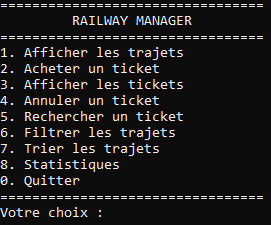

# Railway Manager

<p align="center">
  
</p>

A menu-driven JavaScript program for managing railway trips and passenger tickets. The program includes functionalities for displaying trips, buying tickets, searching and cancelling tickets, filtering and sorting trips, and displaying statistics.

## Features

### Core Functionalities

* **Display Trips**: View available railway trips with departure, destination, time, price, and available seats.
* **Buy Tickets**: Buy a ticket by choosing a trip and entering the passenger name.
* **Display Tickets**: View all purchased tickets.
* **Cancel Tickets**: Cancel a ticket using its ID.
* **Search Tickets**:

  * By ID.
  * By passenger name.
* **Filter Trips**: Search trips by departure city.
* **Sort Trips**: Sort trips by price.
* **Statistics**:

  * Total number of tickets.
  * Total revenue.
  * Most sold trip.

### Data Management

* Predefined railway trips between Moroccan cities.
* Ticket and trip information stored in arrays.
* Manual search and sorting using loops.
* Automatic ticket IDs and seat numbers.

## Requirements

* Node.js.
* `prompt-sync` package.
* Basic understanding of JavaScript.

## How to Use

1. Clone or download the repository.
2. Install the required package:

```bash
npm install prompt-sync
```

3. Run the program:

```bash
node railway_manager.js
```

4. Choose an option from the menu.
